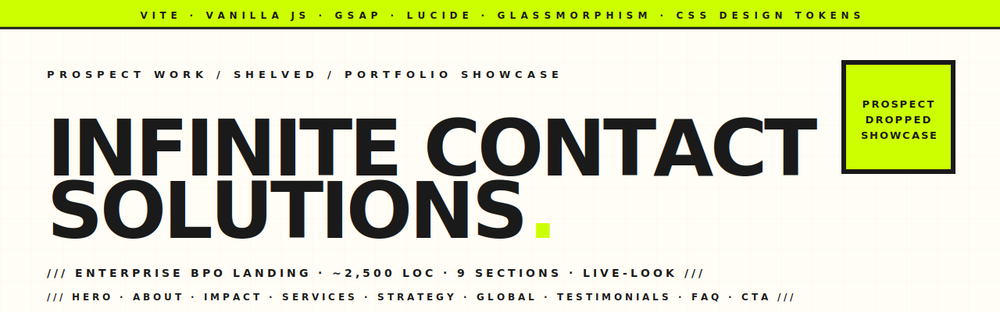

<p align="center">
  <picture>
    <source media="(prefers-color-scheme: dark)" srcset="assets-readme/hero-banner-dark.svg" />
    
  </picture>
</p>

<p align="center">
  
  
  
  
  <a href="LICENSE"></a>
</p>

<p align="center">
  <em>Enterprise BPO marketing site I built for a prospect that ended up backing out of the engagement. Rather than letting ~2,500 LOC of GSAP-animated, glassmorphic, design-token-driven landing-page work die in a folder, it's been polished, sanitised, and published as a portfolio showcase. Vite + vanilla JS, no framework, no backend, no tracking — the whole site is a single static bundle.</em>
</p>

---

### `/// THE BRIEF (NOT-FULFILLED EDITION)`

A US-based BPO prospect with ambitions to scale Philippines-staffed teams for North-American clients wanted a marketing site that felt premium and global, not template-y. The pitch was: glassmorphism over a deep slate gradient, big editorial typography (Playfair Display headlines, Inter body), GSAP scroll choreography, animated impact stats, and a clear "talk to us" funnel. I built it, they shelved the project. So it's here.

The repo is **2.0 of what they would have shipped** — sanitised contact details (no live email/phone), demo-only contact form, plus a few sections (Testimonials, FAQ, pre-footer CTA, scroll-progress indicator) that the original brief didn't include but that any real B2B site needs.

---

### `/// SECTIONS`

```
┌────────────────────────────────────────────────────────────────┐
│ Branded loader with animated bar + percent counter             │
├────────────────────────────────────────────────────────────────┤
│ Sticky nav, scroll-progress bar, mobile hamburger drawer       │
├────────────────────────────────────────────────────────────────┤
│ Hero — gradient headline, animated stats bar, dual CTAs        │
├────────────────────────────────────────────────────────────────┤
│ Marquee — infinite text scroll, gradient typography mixed      │
├────────────────────────────────────────────────────────────────┤
│ About — layered glass cards, value props, check-list           │
├────────────────────────────────────────────────────────────────┤
│ Impact — 4 cards: animated counters, ring chart, before/after  │
├────────────────────────────────────────────────────────────────┤
│ Services — three glass cards with coloured radial blobs        │
├────────────────────────────────────────────────────────────────┤
│ Strategy — 4-step process (Discover / Design / Deploy /        │
│   Optimize) on a dark band                                     │
├────────────────────────────────────────────────────────────────┤
│ Global Command Center — Texas / Manila / Cloud nodes           │
├────────────────────────────────────────────────────────────────┤
│ Testimonials (2.0 — new) — three glass cards w/ avatar +       │
│   star rating + quote                                          │
├────────────────────────────────────────────────────────────────┤
│ FAQ (2.0 — new) — accordion with 5 Q/As on real BPO buying    │
│   objections (ramp, security, pricing, languages, exit)        │
├────────────────────────────────────────────────────────────────┤
│ Contact — info column + glass form (demo-mode; no submit)      │
├────────────────────────────────────────────────────────────────┤
│ Pre-footer CTA strip — dark gradient, single conversion push   │
├────────────────────────────────────────────────────────────────┤
│ Footer — three-column links, copyright                         │
└────────────────────────────────────────────────────────────────┘
```

---

### `/// HIGHLIGHTS`

| | |
|---|---|
| **Design tokens** | All colours, radii, shadows, gradients in `src/styles/variables.css`. Re-skin the whole site by editing one file. |
| **GSAP scroll choreography** | Hero stagger, per-section reveals via ScrollTrigger, ring-chart stroke-dashoffset, counter ease-out cubic. Pinned to 3.12.5 (no `@latest`). |
| **Glassmorphism + hover lift** | `backdrop-filter: blur(...)` cards across about / impact / services / testimonials with a tasteful `translateY(-4px)` + soft shadow on hover. |
| **Scroll-progress indicator** | Top-of-viewport 3px bar tracks document scroll (single passive listener, shared with active-section detection). |
| **Demo-mode contact form** | Inline banner inside the form explicitly says it's a portfolio demo. Submitting fires a toast notification and never hits a network. For a live build, wire to Formspree / Resend / your own endpoint. |
| **Accessibility-aware accordion** | FAQ section uses native `<details>` / `<summary>` — works without JS, screen-reader friendly, animates the `+` → `×` toggle. |
| **SEO scaffolding** | Open Graph + Twitter Card meta, JSON-LD Organization schema, inline SVG favicon, `theme-color` for browser chrome. |
| **No backend, no tracking** | Static bundle. The site doesn't phone home — no analytics scripts, no pixels. |
| **Inter + Playfair Display** | Editorial pairing — Playfair for serif headlines, Inter for body and UI. Loaded once via Google Fonts with `preconnect`. |
| **iPhone-friendly hamburger** | Lucide icon swaps between `menu` and `x` on toggle; mobile-menu closes on link click. |

---

### `/// 2.0 — WHAT CHANGED FROM PROSPECT VERSION`

The 1.0 was what the prospect was going to receive. 2.0 is what makes sense for a public showcase:

- **Sanitised contact details** — the prospect's real email and phone replaced with `hello@example.com` / `+1 (555) 010-0000`. They backed out; their contact info shouldn't be Google-indexable.
- **Demo-mode contact form** — inline banner + toast on submit so a casual visitor doesn't think they actually sent an inquiry.
- **New Testimonials section** — three glass cards with avatar + star rating, with an explicit "these are placeholders for the portfolio demo" disclaimer below.
- **New FAQ accordion** — five real BPO buying objections, not lorem-ipsum. Uses `<details>`/`<summary>` so it works without JS.
- **New pre-footer CTA strip** — dark gradient, single conversion push. The kind of pattern Stripe, Vercel, Linear all use.
- **Scroll-progress bar** at the top, fed by the same scroll listener that handles nav state.
- **Card hover-lift** across glass cards (subtle `translateY(-4px)` + cyan-tinted shadow).
- **Open Graph + Twitter Card meta**, inline SVG favicon, JSON-LD `Organization` schema, `theme-color`.
- **Pinned CDN versions** (`gsap@3.12.5`, `lucide@0.469.0`) — no surprise breakage from `@latest`.

---

### `/// STACK`

```
Vite 6              · static SPA bundler
Vanilla JavaScript  · ~200 LOC of GSAP + nav + form choreography
GSAP 3.12 + ScrollTrigger
Lucide icons        · inline SVG via CDN
CSS custom properties · 700 lines, eight files split by concern
Inter + Playfair Display · via Google Fonts
```

No frameworks, no build steps beyond Vite, no Node beyond install / dev / build.

---

### `/// PROJECT LAYOUT`

```
InfiniteCS-Website/
├── index.html                         single-page site, all sections
├── package.json                       vite only
├── vite.config.js
├── src/
│   ├── main.js                        loader · GSAP · nav · scroll-progress · form
│   └── styles/
│       ├── variables.css              design tokens (colors, radii, shadows, fonts)
│       ├── layout.css                 container + grid utilities
│       ├── nav.css                    sticky nav, mobile menu, hamburger
│       ├── hero.css                   hero, blobs, badge, stats pills
│       ├── sections.css               about, impact, services, strategy, global,
│       │                              testimonials (2.0), FAQ (2.0), pre-footer CTA (2.0),
│       │                              hover-lift, scroll-progress, demo-mode toast
│       ├── contact.css                contact section + form
│       └── animations.css             keyframes (blob, marquee, loader)
└── assets-readme/                     brutalist banner SVGs (light + dark)
```

---

### `/// LOCAL DEV`

```bash
npm install
npm run dev       # vite dev server → http://localhost:5173
npm run build     # production bundle → dist/
npm run preview   # serve dist/ → http://localhost:4173
```

Static output — drop `dist/` onto any host (Vercel, Netlify, S3 + CloudFront, GitHub Pages).

---

### `/// LICENSE`

[MIT](LICENSE). Fork it, learn from it, re-skin it for your own BPO pitch — just keep the copyright line. The prospect's name and any company-specific copy are placeholders / generic; rewrite to suit yours.

---

<p align="center">
  <a href="https://hatimelhassak.is-a.dev"></a>
  <a href="https://cal.com/hatimelhassak/engineering-discovery"></a>
  <a href="https://www.linkedin.com/in/hatim-elhassak/"></a>
  <a href="mailto:hatimelhassak.official@gmail.com"></a>
</p>

<p align="center">
  <code>///&nbsp;&nbsp;OPEN FOR NEW WORK&nbsp;&nbsp;///&nbsp;&nbsp;CONTRACT &amp; FREELANCE&nbsp;&nbsp;///&nbsp;&nbsp;REMOTE WORLDWIDE&nbsp;&nbsp;///</code>
</p>
